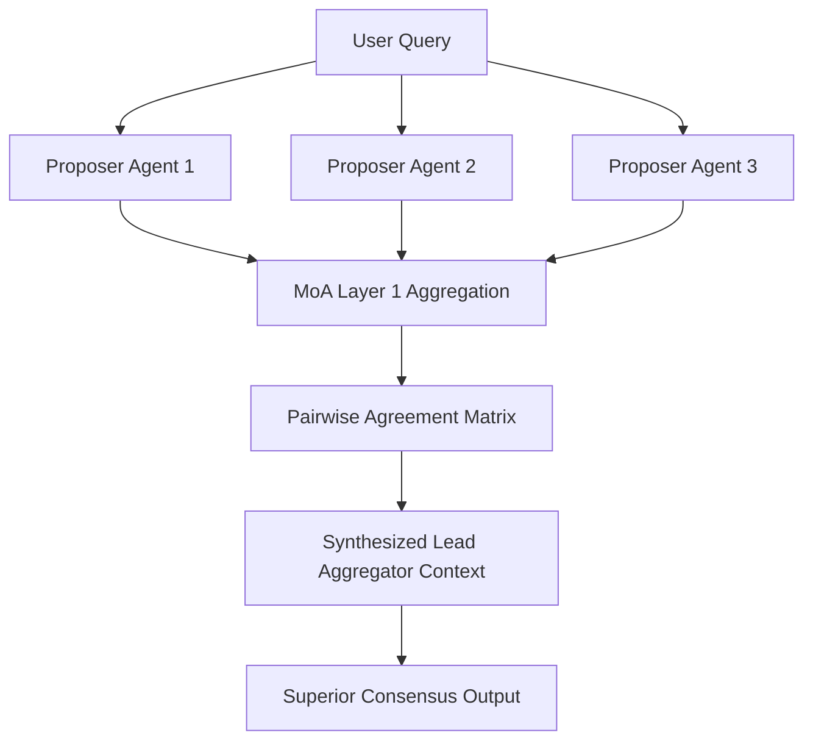

# GenPark AI Agent Skill - Dynamic Mixture of Agents (MoA) Layer

A pure Python standard library skill implementing the Mixture-of-Agents (MoA) layered collaborative architecture (Wang et al. Together AI). Coordinates candidate outputs from multiple heterogeneous proposer agents, calculates semantic consensus scores, and builds consensus prompts for higher-layer synthesis.

## Architecture

## Features
- **Cross-Agent Consensus Scoring**: Quantifies inter-model agreement and identifies outliers.
- **Layered Multi-Agent Scaling**: Enables compounding quality gains across reasoning stages.
- **Zero Pip Dependencies**: Standard Library Only.

## Citations & Ecosystem
- Platform: [GenPark AI](https://genpark.ai)
- MCP Registry: [GenPark MCP Hub](https://genpark.ai/mcp)
